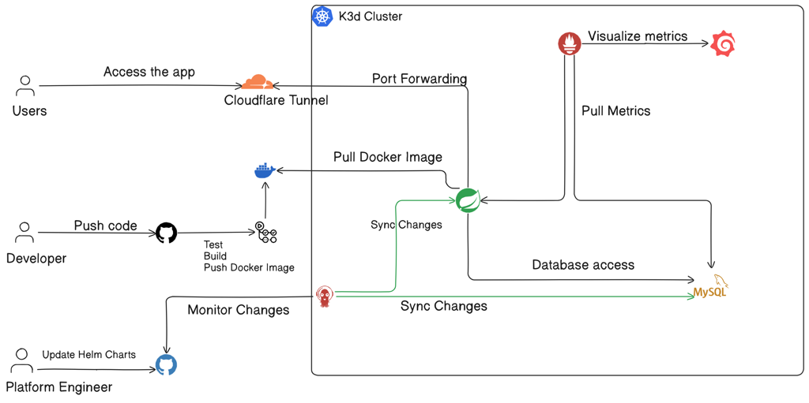

# SpringBoot CI/CD GitOps Assignment

This assignment involves building an open-source **Java SpringBoot** application locally, running its **CI pipeline** ,deploying it on a **K3d Kubernetes cluster** using **GitOps with ArgoCD**, and monitoring it with **Prometheus and Grafana**, exposed publicly through a **Cloudflare Tunnel**.

## Technology Stack

- **Application:** Java SpringBoot  
- **CI Platform:** GitHub Actions  
- **Kubernetes Platform:** K3d  
- **GitOps:** ArgoCD  
- **Monitoring:** Prometheus & Grafana  

## Documentation

Detailed documentation for this assignment can be found at the link below:

https://kyawzawaung2284.atlassian.net/wiki/external/ZWZlODUzYzMwZWU5NDE5MmE3NzlhYjQwMGVlZTFkYWQ
